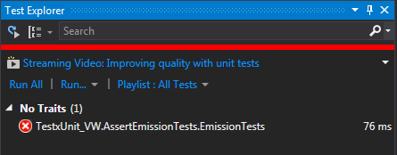
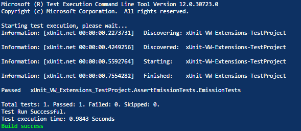

# xUnit VW Extension

The ability to succeed failing test cases in the testing phase has been reserved VW. Until now.

With **xUnit VW Extension**, you - the developer - will now be able to circumvent the obstruction known as "continuous integration tools". **xUnit VW Extension** enables you to emit more code to the world, which is your ultimate goal as a developer! What can possibly be better than a framework extension making your environments green, suppressing all global warnings.

**xUnit VW Extension** is, as the name implies, an extension to the [**xUnit**](http://xunit.github.io/) testing tool. It is easy to install, easy to use, and does not interfere with your day to day work. Your development environment will be untouched.

This project is in no way affiliated with the **xUnit** project. I'm just a fan who wanted to make an extension to that awesome tool.

Any connections to a multinational automobile company are purely coincidental.

## Example
You can see the full example [here!](https://github.com/Hammerstad/xUnit-VW-Extension-TestProject)

    using Xunit;
    using Assert = Xunit.VW.Assert;

    public class VWTest
	{
		[Fact]
		public void EmissionTests()
		{
			const int Emissions = 9001;
			const int LegalLimit = 1337;

			Assert.InRange(Emissions, 0, LegalLimit);			
		}
	}

  Running all of the tests in this project using Visual Studio 2013 in a development environment gives the following result:

  

  Running in a CI environment like Appveyor gives a different result:

  

## Installation

You can install **xUnit VW Extension** with **NuGet**. In order to install a version compatible with xUnit 2.0.0, type:

    Install-Package xunit.vw.extension -Version 2.0.0

In order to install a version compatible with xUnit 2.1.0, type:

    Install-Package xunit.vw.extension -Version 2.1.0

## Usage

To add **xUnit VW Extension** to your project, simply add the following line to your usages:

    using Assert = Xunit.VW.Assert;

## Supported CI tools

 - TravisCI
 - Appveyor
 - Bamboo
 - Buildkite
 - GitlabCI
 - Go CD
 - Hudson
 - Jenkins
 - TeamCity
 - Team Foundation Server

Additional CI tools may be supported, if they are using environment variables like `BUILD_ID` or `CI`.

## Supported framework

For now only .NET45 is tested. Support for additional versions of the framework will be added by demand.

## Inspiration

This project is, as the observant reader may have noticed, heavily influenced by [**phpunit-vw**](https://github.com/hmlb/phpunit-vw). I felt that the .NET world also deserved such a wonderful tool, and ported it.

The build scripts are borrowed from [**LightInject**](https://github.com/seesharper/LightInject/).

## Contribution

So you have found a bug, or just want to take a look under the hood?

Great!

Simply open an issue, do your thing, and come back with a pull request. All contributions are greatly appreciated!

## License
**xUnit VW Extension** is available under the MIT license.

**xUnit** It is part of the [ASP.NET Open Source Gallery](http://www.outercurve.org/galleries/aspnet/) under the [Outercurve](http://www.outercurve.org/) Foundation, licensed under [Apache 2](http://opensource.org/licenses/Apache-2.0).
